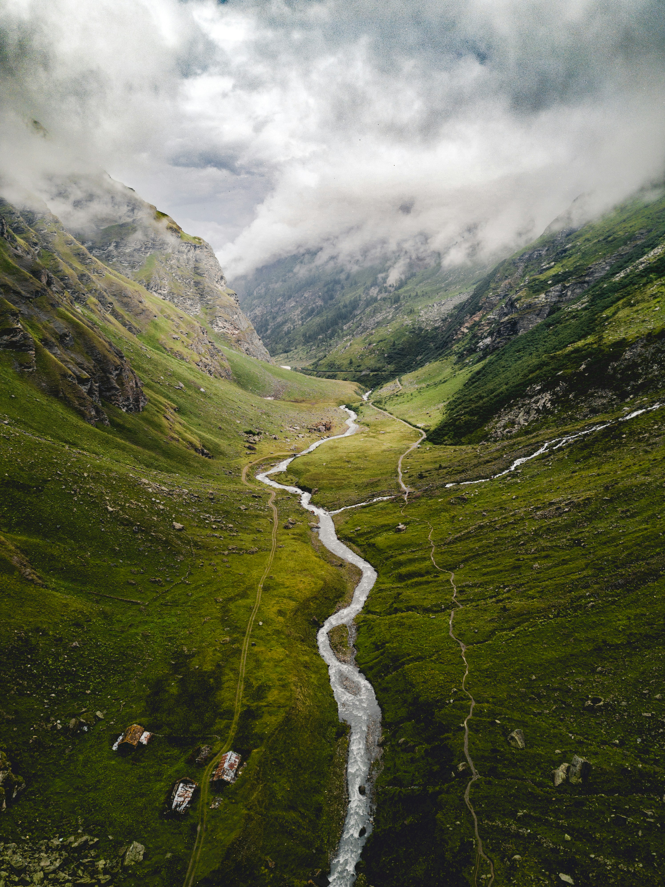
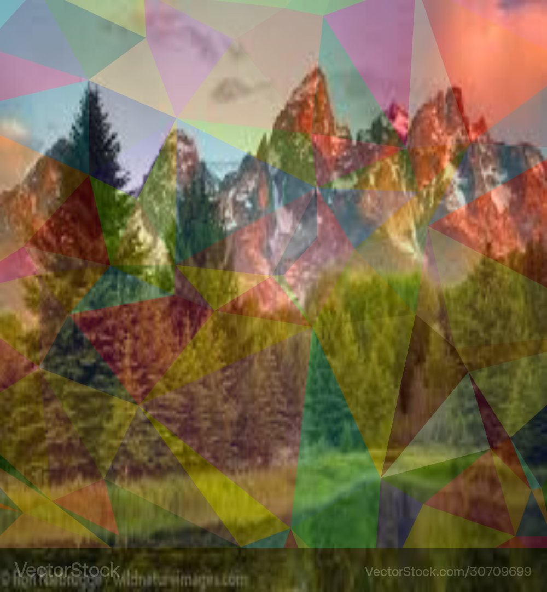

# Node-Based Image Manipulation Framework

This framework is built in C++ and offers node-based image manipulation functionality. Each node is designed to handle a specific image processing task such as adjusting brightness/contrast, applying filters, edge detection, and more. The nodes are linked together, allowing users to create their own customizable image processing pipelines.

## Core Features

- **Modular Architecture**: Each image processing task is separated into distinct nodes, which can be easily linked together.
- **Versatile Image Manipulation**: The framework supports various operations including input/output handling, color channel adjustments, brightness/contrast tuning, blurring, edge detection, and more.
- **Graph-Based System**: Nodes are connected to form a directed acyclic graph (DAG), ensuring smooth data flow and processing efficiency.
- **Expandability**: The framework allows developers to extend its capabilities by adding new processing nodes.

## Main Components

### Available Nodes

- **ImageInputNode**: Loads an image and supplies it to the system for further processing.
- **OutputNode**: Saves the final processed image to the file system.
- **ColorChannelSplitterNode**: Separates an image into individual color channels (RGB).
- **BrightnessContrastNode**: Adjusts the image's brightness and contrast.
- **BlurNode**: Applies either Gaussian or directional blur to the image.
- **ThresholdNode**: Converts the image to binary using various thresholding techniques (binary, adaptive, Otsu).
- **EdgeDetectionNode**: Detects edges using Sobel or Canny edge detection algorithms.
- **BlendNode**: Blends two images using various techniques.
- **NoiseGeneratorNode**: Introduces noise into the image for effect.
- **ConvolutionFilterNode**: Applies a custom convolution filter to the image.

### Supported Operations

1. **Load and Save Image**: Import and export images in multiple formats such as JPG, PNG, etc.
2. **Color Channel Manipulation**: Isolate and combine color channels for focused processing.
3. **Brightness/Contrast Adjustment**: Change the image's brightness and contrast.
4. **Blurring**: Apply Gaussian or directional blur to soften the image.
5. **Edge Detection**: Detect edges using Sobel or Canny edge detection.
6. **Thresholding**: Transform the image into binary format using different thresholding methods like Otsu, binary, or adaptive.
7. **Blending**: Merge two images together using various blending techniques.

## Sample Processed Images

### Original Image
Here's an example of the original unprocessed image:


### Grayscale Image
This is the result after converting the image to grayscale:


### Edge Detection (Sobel)
Here is an result using the blur algorithm:


### Edge Detection (Canny)
This image shows the result of edge detection using the Canny algorithm:


### Blended Image
This image is the result of blending two images using the 'multiply' operation:


## Setup Instructions

### Prerequisites

- **C++11 or later**: The framework is written in C++ and requires at least C++11.
- **OpenCV**: OpenCV is used for various image manipulation tasks.
- **ImGui**: For building the user interface to control parameters for each node.

### Required Libraries

1. OpenCV (for handling image operations)
2. ImGui (for creating GUI components)

### Steps to Build the Project

1. Clone the repository to your local machine:

    ```bash
    git clone https://github.com/yourusername/node-based-image-manipulation.git
    ```

2. Install OpenCV and ImGui, either via a package manager or by building them from source.
3. Create the necessary `CMakeLists.txt` file for building the project.
4. Generate the build files and compile the project using CMake:

    ```bash
    cmake .
    make
    ```

5. Run the application:

    ```bash
    ./node-image-manipulation
    ```

## How to Use

Once the application starts, the following actions are available:

1. **Load Image**: Load an image from the file system for processing.
2. **Apply Operations**: Select from a variety of operations such as brightness/contrast adjustment, edge detection, blur, etc.
3. **Save Output Image**: Save the final image after processing.
4. **Merge Color Channels**: Combine individual color channels back into a full image.
5. **Edge Detection**: Choose to apply Sobel or Canny edge detection to the image.
6. **Thresholding**: Convert the image to binary using different thresholding techniques.

## Example Workflow

Follow these steps to process an image:

1. Load an image.
2. Apply a blur effect (either Gaussian or directional).
3. Perform edge detection (choose between Sobel or Canny).
4. Save the processed image.

## Planned Future Features

- **Graphical User Interface (GUI)**: Integrate a full-fledged GUI for better user interaction (e.g., using Qt).
- **Advanced Image Processing Nodes**: Add features like image sharpening, noise reduction, and more.
- **Batch Processing**: Extend the system to process multiple images at once, applying the same operations to a batch of images.

## License Information

This project is licensed under the MIT License. See the [LICENSE](LICENSE) file for more information.

## Acknowledgments

- **OpenCV**: A powerful library used for various image processing tasks.
- **ImGui**: An immediate mode graphical user interface library used for building the control interface.

